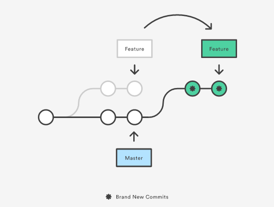

# Convenções GIT

Conjunto de convenções para facilitar o trabalho colaborativo entre membros de uma equipe de desenvolvimento.

## Sumário

Este projeto se divide nas seguintes seções:
- [Branches](#branches)
- [Fluxo para `criação` de branches](#fluxo-criacao)
- [Fluxo para `atualização local` de branches](#fluxo-atualizacao-local)
- [Fluxo para `atualização remota` de branches](#fluxo-atualizacao-remota)
- [Mensagens em commits](#mensagem-em-commits)
- [Pull Request](#pull-request)
- [Branches `main` e `develop`](#branches-main-develop)
- [Rotina de trabalho](#rotina-trabalho)
- [Comandos GIT](#comandos-git)

## <a name="branches"></a>Branches

Todos os repositórios terão um conjunto de branches, sendo elas:
- `main`: principal branch do repositório. Representa o código que está em produção no momento;
- `develop`: branch de desenvolvimento. Todas as features aprovadas em um PR e que estão em teste/homologação, mas ainda não foram publicadas para produção, estão nesta branch;
- `feat/<task>/<name>`: branch para desenvolvimento de uma nova feature. Sempre que uma branch dessa for criada, deve ser criada a partir da branch `develop`;
- `fix/<task>/<name>`: branch para desenvolvimento de uma correção. Sempre que uma branch dessa for criada, deve ser criada a partir da branch `main`;
- `refactor/<task>/<name>`: branch para trabalhar com refactors. Sempre que uma branch dessa for criada, deve ser criada a partir da branch `develop`.

Obs.:
- `<task>` se refere ao código gerado pelo sistema de gerenciamento de tasks (por exemplo, Jira), caso não tenha um sistema desses, pule. Utilize _kebab-case_ na nomenclatura;
- `<name>` é um identificador para facilitar o reconhecimento da task. Utilize _kebab-case_ na nomenclatura.

Exemplo de branches:
- `main`;
- `develop`;
- `feat/git-001/proposta-convencoes`;
- `fix/git-002/correcao-palavra`;
- `refactor/git-003/mudanca_fluxo`.

## <a name="fluxo-criacao"></a> Fluxo para criação de branches

Este fluxo é simples e completamente independente do tipo de branch que está sendo criada. A ideia geral é a seguinte:

1) Entenda o que a task pede. É uma correção de bug, uma nova feature ou um refactor? Isso deve guiar o tipo de branch que será criada e a partir de qual;
2) Uma vez que o tipo de branch foi decidido, busque as informações do código da task e escolha um nome como identificá-la;
3) Baixe todas as atualizações que ocorreram no repositório remoto;
4) Faça _checkout_ na branch base local e atualize ela (`main` ou `develop`);
5) A partir da branch base, crie uma nova branch seguindo a convenção de nomenclatura especificada na seção [branches](#branches).

Exemplo:

Task GIT-004 é um fix referente a um erro na numeração da lista no README.md.

Com essa informação definimos o nome da branch como: `fix/git-004/numeracao-lista`

Branch base: `main`

```bash
# Baixa as atualizações
$ git fetch -p

# Seleciona a branch main
$ git checkout main

# Atualiza a branch main
$ git rebase

# Cria uma nova branch fix/git-004/numeracao-lista a partir da branch main
$ git checkout -b fix/git-004/numeracao-lista
```

## <a name="fluxo-atualizacao-local"></a>Fluxo para `atualização local` de branches

Este fluxo é muito parecido com o de criação de branches, com uma pequena variação no final. A ideia geral é a seguinte:

1) Baixe todas as atualizações que ocorreram no repositório remoto;
2) Faça _checkout_ na branch base local e atualize ela (`main` ou `develop`). Utilize a mesma branch base que foi utilizada durante a criação;
3) Faça _checkout_ na branch que deseja atualizar;
4) Atualize sua branch local.

Exemplo:

Durante o trabalho na branch `fix/git-004/numeracao-lista`, uma outra correção foi publicada na branch `main` (branch base).

```bash
# Baixa as atualizações
$ git fetch -p

# Seleciona a branch main
$ git checkout main

# Atualiza a branch main
$ git rebase

# Seleciona a branch fix/git-004/numeracao-lista
$ git checkout fix/git-004/numeracao-lista

# Atualiza a branch fix/git-004/numeracao-lista a partir da branch main
$ git rebase main
```

## <a name="fluxo-atualizacao-remota"></a>Fluxo para `atualização remota` de branches

Existem similaridades com os fluxos anteriores, mas alguns detalhes a mais quando se vai enviar código para o repositório remoto. São 2 tipos diferentes de fluxos aqui, o primeiro para branches que ainda não existem no repositório remoto e o segundo para branches que já existem. Veja os fluxos abaixo:

### Branches que não existem no repositório remoto

1) Descubra o nome do repositório remoto. O padrão é `origin`, mas não é necessariamente sempre este;
2) Siga os passos do fluxo de atualização local de branches (sempre envie a branch o mais atualizada possível para o repositório remoto);
3) Faça _checkout_ na branch que deseja enviar;
4) Envie a branch para o repositório remoto.

Exemplo:

Envio da branch `fix/git-002/correcao-palavra` para o repositório remoto.

```bash
# Obtém o nome do repositório remoto (opcional)
$ git remote -v

# Siga os passos do fluxo de atualização local de branches
$ ...

# Seleciona a branch fix/git-002/correcao-palavra
$ git checkout fix/git-002/correcao-palavra

# Envie a branch para o repositório remoto
$ git push --set-upstream origin fix/git-002/correcao-palavra
```

### Branches que existem no repositório remoto

1) Baixe todas as atualizações que ocorreram no repositório remoto;
2) Faça _checkout_ na branch base local e atualize ela (`main` ou `develop`). Utilize a mesma branch base que foi utilizada durante a criação;
2) Faça _checkout_ na branch que deseja enviar ao repositório remoto;
4) Atualize sua branch local a partir do repositório remoto;
5) Atualize sua branch local a partir da branch base;
6) Envie a branch para o repositório remoto.

Exemplo:

Durante o trabalho na branch `refactor/git-003/mudanca_fluxo`, foram publicadas novas features na branch `develop`, assim como um novo commit existe no repositório remoto para a branch `refactor/git-003/mudanca_fluxo`.

```bash
# Baixa as atualizações
$ git fetch -p

# Seleciona a branch develop
$ git checkout develop

# Atualiza a branch develop
$ git rebase

# Seleciona a branch refactor/git-003/mudanca_fluxo
$ git checkout refactor/git-003/mudanca_fluxo

# Atualiza a branch refactor/git-003/mudanca_fluxo a partir do repositório remoto
$ git rebase

# Atualiza a branch refactor/git-003/mudanca_fluxo a partir da branch develop
$ git rebase develop

# Envie a branch para o repositório remoto
$ git push
```

## <a name="mensagem-em-commits"></a>Mensagens em commits

As mensagens de commit devem seguir um padrão já determinado, tanto para facilitar o entendimento da equipe de desenvolvimento quanto automatizar o changelog dos projetos.

[Clique aqui](https://www.conventionalcommits.org/) para uma descrição detalhada das regras nas mensagens.

## <a name="pull-request"></a>Pull Request

_Pull request_ (ou PR) nada mais é do que uma solicitação para adicionar um código ao projeto. Esta solicitação é uma importante ferramenta para ajudar na colaboração entre os membros da equipe, já que antes do código ser realmente incorporado ao projeto é possível discutir possíveis melhorias, diferentes formas de atingir o mesmo objetivo e/ou a possível introdução de bugs.

Sobre o tamanho do PR, não há um limite definido, seja por quantidade de linhas, número de arquivos alterados, etc, porém PRs menores são mais simples e fáceis de revisar, sendo assim tente sempre criar um PR enxuto e que proponha uma quantidade não muito grande de alterações. Note que um PR muito grande, provavelmente é uma atividade também muito grande e que provavelmente poderia ser dividida em atividades menores.

Sobre a criação do PR é interessante observar alguns pontos:
- ___branch de mesclagem___: definir com qual branch o código será mesclado. Neste caso basta verificar a partir de qual branch o código foi criado ou qual o prefixo da branch, exemplo: `feat` e `refactor` devem escolher a branch `develop` para mesclagem, já o prefixo `fix` deve escolher a branch `main`.
- ___título___: utilizar o formato "\<task> \<descricao>", exemplo: [GIT-001] Proposta de convenção para GIT;
- ___criador___: marque o responsável pela atividade;
- ___revisores___: marque todos os membros da equipe que podem contribuir com a revisão de uma atividade;
- ___labels___: utilize as _labels_ para identificar do que se trata o projeto;
- ___corpo do PR___: adicionar o link para a atividade no sistema de gerenciamento (caso esteja utilizando algum) e uma descrição das alterações que o PR deseja incorporar ao projeto. Exemplo de descrição:
> Link da task: \<url>
> 
> A task ___GIT-001___ tem como objetivo criar um repositório com detalhes de como a equipe de desenvolvimento pode trabalhar com ferramentas de versionamento de maneira mais eficiente e eficaz.
>
> Para essa demanda foi criado um repositório GIT com uma documentação contendo detalhes relacionados diferentes fluxos de trabalho, convenções e detalhes do funcionamento dos comandos GIT.

Sobre a revisão do PR é importante destacar:
- O revisor deve ter um entendimento da regra de negócio trabalhada no PR;
- Durante a revisão garanta que o PR não quebra a arquitetura proposta no projeto, mantendo o projeto funcional e escalável como proposto inicialmente;
- Verifique por códigos duplicados (tanto no PR quanto fora dele), padrões de projeto mal utilizados, não entendimento nas regras de negócio ou possíveis bugs;
- Se for pertinente, sugira outras formas de realizar a mesma ação, o objetivo é que todo o time evolua tanto como equipe quanto com conhecimento técnico;
- Em caso de dúvidas, converse com a pessoa que criou o PR;
- Coloque todos esses pontos em comentários no PR, assim fica um registro para facilitar o entendimento posterior. Nem sempre a pessoa que criou o PR vai ajustar tudo no momento, então o registro serve como um lembrete do que foi conversado;
- Verifique a branch que o código será mesclado. A branch está correta?;
- Por último, é importante que haja respeito! Quem está revisando não sabe mais do que quem tem seu PR revisado e vice-versa. A colaboração é fundamental.

Sobre a mesclagem do PR:
1) O PR deve ser aprovado por pelo menos 1 revisor identificado durante a criação do PR;
2) Caso haja algum recurso de automação (para testes ou deploy, por exemplo), é necessário que o recurso de automação também aprove o PR;
3) Uma vez que todas as aprovações tenham sido efetuadas, o criador do PR, não o revisor, deve efetuar a mesclagem;
4) No caso do GitHub, a estratégia de mesclagem deve ser: `squash and merge`.

## <a name="branches-main-develop"></a>Branches `main` e `develop`

Seguem algumas considerações sobre as branches `main` e `develop`:
- Deve-se tornar a branch `develop` como default, para evitar erros onde o PR aponta a mesclagem para a branch `main` por engano (lembre-se a `main` é a branch de produção);
- Deve-se bloquear o merge direto na branch `main`, para evitar que códigos sem revisão sejam enviados para produção;
- As _releases_ (mesclagem de código a `main` e deploy em produção) devem levar em consideração o tempo da sprint e devem ser feitas exclusivamente por uma pessoa definida pelos membros da equipe.
- Sempre que uma nova release for lançada (independente de ser feature, refactor ou hotfix), a branch `develop` deve ser atualizada. É importante que a branch `develop` esteja sempre igual ou a frente em commits, para garantir que todos os membros da equipe estejam com suas branches de trabalho atualizadas.

## <a name="rotina-trabalho"></a>Rotina de trabalho

Para exemplificar todas ou pelo menos a maioria das convenções adotadas neste documento, segue um exemplo da rotina de trabalho ao longo de alguns dias.

Imagine uma equipe composta por 3 pessoas, Gabriel, Álisson e Marcelo (líder desta equipe). O time possui uma lista de atividades a fazer e Álisson sendo um destes desenvolvedores foi designado para a atividade "EQP1-002 - Criar um endpoint para atualização de usuário".

### Dia 1

Para começar a trabalhar, Álisson clona o projeto para seu ambiente de trabalho local.

```bash
# Navega para o diretório de projetos
$ cd projects

# Clonar o projeto 
$ git clone git@github.com:alissonfpmorais/git-conventions.git

# Navega para diretório do projeto
$ cd git-conventions
```

Sabendo que a task é uma nova feature, ele cria uma nova branch `feat/epq1-002/atualizacao-usuario` a partir da branch `develop` (como definido na seção [Fluxo para criação de branches](#fluxo-criacao)).

```bash
# Baixa as atualizações
$ git fetch -p

# Seleciona a branch main
$ git checkout main

# Atualiza a branch main
$ git rebase

# Cria uma nova branch feat/epq1-002/atualizacao-usuario a partir da branch main
$ git checkout -b feat/epq1-002/atualizacao-usuario
```

Ao longo do dia ele cumpre parte de seu trabalho e decide enviar o trabalho feito para o repositório remoto (como definido na seção [Fluxo para atualização local de branches](#fluxo-atualizacao-local) e também no primeiro tipo da seção [Fluxo para atualização remota de branches](#fluxo-atualizacao-remota)).

```bash
# Obtém o nome do repositório remoto (opcional)
$ git remote -v
# origin  git@github.com:alissonfpmorais/git-conventions.git (fetch)
# origin  git@github.com:alissonfpmorais/git-conventions.git (push)
# "origin" é o nome do repositório remoto

# Faz o "stage" das modificações no repositório local
$ git add .

# Cria um último commit com as modificações no projeto
$ git commit -m "feat: adicionada função de atualizar no repositório 'User'"

# Baixa as atualizações
$ git fetch -p

# Seleciona a branch develop
$ git checkout develop

# Atualiza a branch develop
$ git rebase

# Seleciona a branch feat/epq1-002/atualizacao-usuario
$ git checkout feat/epq1-002/atualizacao-usuario

# Atualiza a branch feat/epq1-002/atualizacao-usuario a partir da branch develop
$ git rebase develop

# Envie a branch para o repositório remoto
$ git push --set-upstream origin feat/epq1-002/atualizacao-usuario
```

No fim do dia, Marcelo faz o deploy de uma _release_ contendo o fix de um bug. Tanto a branch `main` quanto a branch `develop` são atualizadas e contém novos commits.

### Dia 2

Logo no início do dia, antes de voltar para o desenvolvimento da atividade, Álisson verifica que existem novos commits na branch `develop` e resolve atualizar sua branch de trabalho local (para evitar futuros conflitos).

```bash
# Baixa as atualizações
$ git fetch -p

# Seleciona a branch develop
$ git checkout develop

# Atualiza a branch develop
$ git rebase

# Seleciona a branch feat/epq1-002/atualizacao-usuario
$ git checkout feat/epq1-002/atualizacao-usuario

# Atualiza a branch feat/epq1-002/atualizacao-usuario a partir da branch develop
$ git rebase develop
```

Durante o dia, Álisson pede ajuda a Gabriel que faz um commit em sua branch de trabalho `feat/epq1-002/atualizacao-usuario`. Álisson finaliza suas implementações e no final do dia vai enviar novamente as alterações para o repositório remoto.

Gabriel faz a mesclagem do PR de uma task que havia pego. A mesclagem é feita na branch `develop`.

```bash
# Faz o "stage" das modificações no repositório local
$ git add .

# Cria um último commit com as modificações no projeto
$ git commit -m "feat: adicionado caso de uso para atualizar usuário"

# Baixa as atualizações
$ git fetch -p

# Seleciona a branch develop
$ git checkout develop

# Atualiza a branch develop
$ git rebase

# Seleciona a branch feat/epq1-002/atualizacao-usuario
$ git checkout feat/epq1-002/atualizacao-usuario

# Atualiza a branch feat/epq1-002/atualizacao-usuario a partir do repositório remoto
$ git rebase

# Atualiza a branch feat/epq1-002/atualizacao-usuario a partir da branch develop
$ git rebase develop

# Envie a branch para o repositório remoto
$ git push
```

### Dia 3

Logo no início do dia, antes de voltar para o desenvolvimento da atividade, Álisson verifica que não existem novos commits na branch `develop` ou na branch `feat/epq1-002/atualizacao-usuario`, portanto não há o que atualizar.

```bash
# Baixa as atualizações
$ git fetch -p
```

No fim do dia ele conclui a última etapa na conclusão da task, portanto decide enviar as atualizações para o repositório remoto e abrir um PR.

```bash
# Faz o "stage" das modificações no repositório local
$ git add .

# Cria um último commit com as modificações no projeto
$ git commit -m "feat: adicionado controller para atualizar usuário"

# Baixa as atualizações
$ git fetch -p

# Seleciona a branch develop
$ git checkout develop

# Atualiza a branch develop
$ git rebase

# Seleciona a branch feat/epq1-002/atualizacao-usuario
$ git checkout feat/epq1-002/atualizacao-usuario

# Atualiza a branch feat/epq1-002/atualizacao-usuario a partir do repositório remoto
$ git rebase

# Atualiza a branch feat/epq1-002/atualizacao-usuario a partir da branch develop
$ git rebase develop

# Envie a branch para o repositório remoto
$ git push
```

Na criação do PR são definidos:
- ___branch de mesclagem___: `develop`.
- ___título___: `EQP1-002 - Criar um endpoint para atualização de usuário`;
- ___criador___: `Álisson`;
- ___revisores___: `Marcelo` e `Gabriel`;
- ___labels___: `feature`;
- ___corpo do PR___: 
> Link da task: #2
> 
> A task ___EQP1-002___ tem como objetivo criar um endpoint para realizar a atualização do usuário.
>
> Para essa demanda foram adicionadas funções de atualização no repositório já existente 'User', assim como no controller 'User'. O caso de uso foi criado do 0, mas maior parte das validações propostas foram reutilizadas do caso de uso da criação do usuário, salvo validações como: bloqueio na edição do CPF e e-mail.

### Dia 4

Gabriel faz a revisão do PR e deixa um comentário apontado um bug na implementação do caso de uso, então Álisson faz as correções conforme pontuado no comentário.

```bash
# Faz o "stage" das modificações no repositório local
$ git add .

# Cria um último commit com as modificações no projeto
$ git commit -m "fix: correção na validação de CPF"

# Baixa as atualizações
$ git fetch -p

# Seleciona a branch develop
$ git checkout develop

# Atualiza a branch develop
$ git rebase

# Seleciona a branch feat/epq1-002/atualizacao-usuario
$ git checkout feat/epq1-002/atualizacao-usuario

# Atualiza a branch feat/epq1-002/atualizacao-usuario a partir do repositório remoto
$ git rebase

# Atualiza a branch feat/epq1-002/atualizacao-usuario a partir da branch develop
$ git rebase develop

# Envie a branch para o repositório remoto
$ git push
```

Gabriel revisa o novo commit enviado por Álisson e aprova o PR.

Álisson faz a mesclage do PR com a branch `develop` utilizando a estratégia `squash and merge` do GitHub.

### Dia 5

Marcelo lança um novo _release_ na branch `main` e atualiza a branch `develop` de acordo.

## <a name="comandos-git"></a>Comandos GIT

Relação de comandos apresentados nos exemplos e o que eles fazem:

### FETCH
Este comando faz o download de todas as atualizações que aconteceram no repositório remoto. A opção "-p", mostra a lista de branches que foram deletadas do repositório remoto (para o caso de você querer deletar do seu repositório local)
```bash
# Exemplo 1
$ git fetch -p
```

### CHECKOUT
Comando para selecionar a branch de trabalho. Também permite criar uma nova branch se utilizado em conjunto a opção "-b"
Sintaxe: `git checkout <branch_name>`
```bash
# Exemplo 1
$ git checkout feat/git-001/proposta-convencoes

# Exemplo 2
$ git checkout -b fix/git-002/correcao-palavra
```

### REBASE
Coloca todos os commits atuais "a frente" dos commits da branch especificada. Como é uma estratégia de merge, pode causar conflitos.



Sintaxe: `git rebase <branch_name>`
```bash
# Exemplo 1
$ git rebase develop

# Exemplo 2
$ git rebase --abort

# Exemplo 3
$ git rebase --continue
```

### PUSH
Envia alterações realizadas nas branches do repositório local para o repositório remoto.

Sintaxe: `git push`
```bash
# Exemplo 1
$ git push

# Exemplo 2
$ git push --set-upstream origin fix/git-002/correcao-palavra

# Exemplo 3
$ git push --force-with-lease

# Exemplo 4
$ git push --follow-tags
```

Obs.: Todos os comandos possuem variações na sintaxe e opções que não foram listadas aqui.